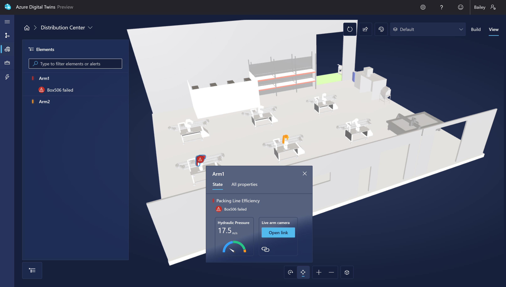
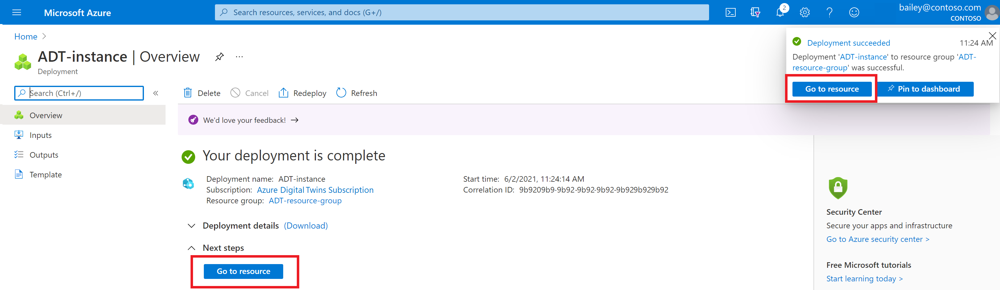
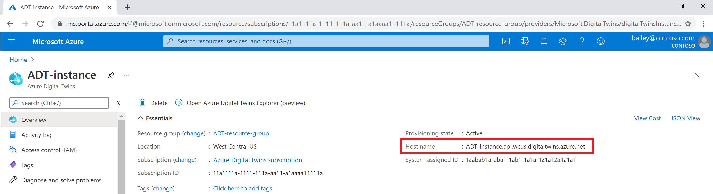
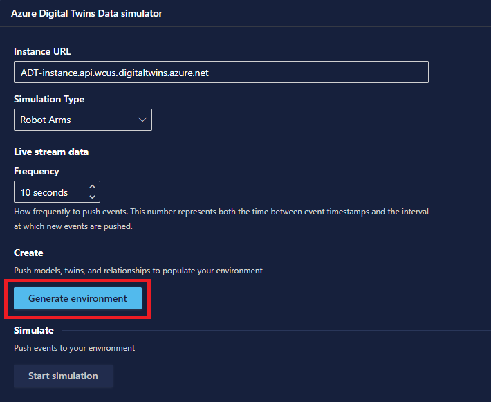
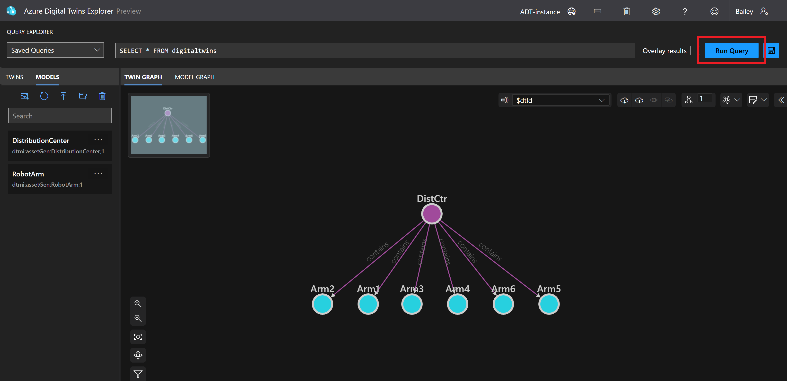
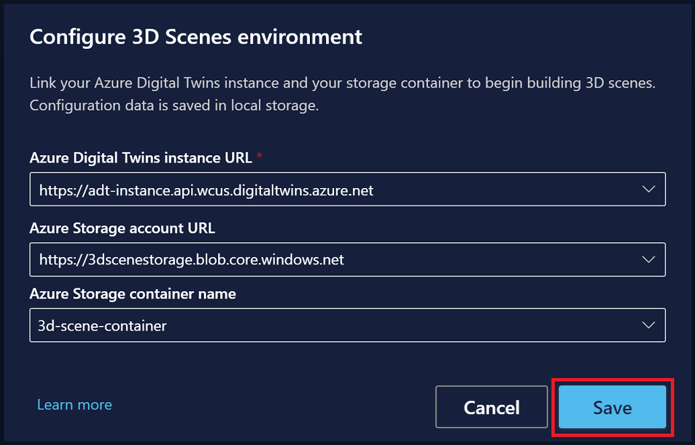
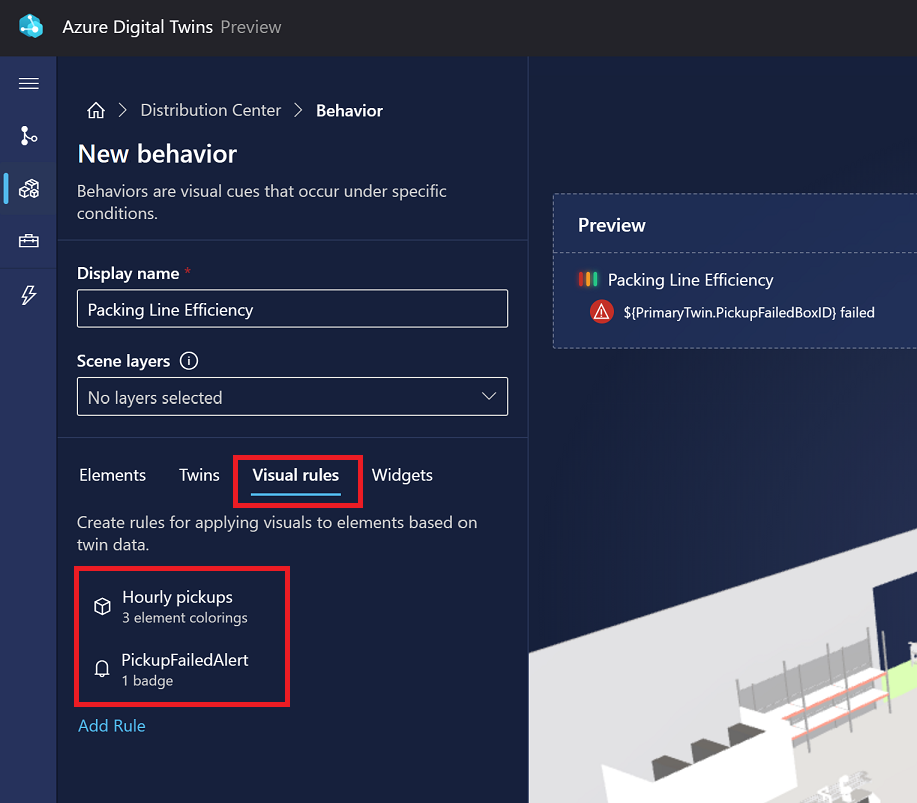
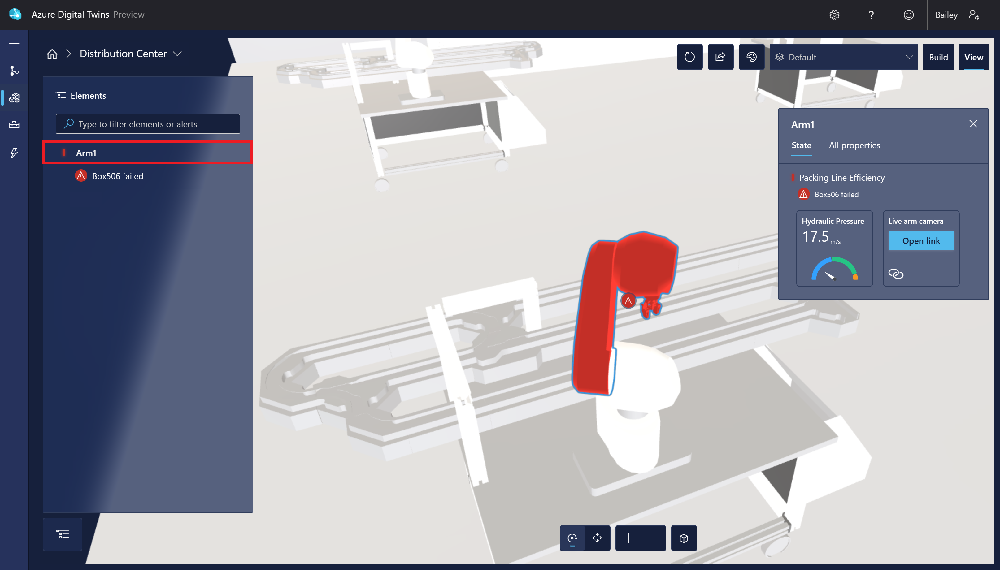

# Get started with 3D Scenes Studio fot DT
[Reference](https://learn.microsoft.com/en-us/azure/digital-twins/quickstart-3d-scenes-studio)
This sample scenario represents a package distribution center that contains six robotic arms. Each arm has a digital twin with properties to track how many boxes the arm fails to pick up, along with the IDs of the missed boxes.


## Prerequisites
- Azure subscription([here](https://azure.microsoft.com/free/?WT.mc_id=A261C142F)).
- Download a sample glTF (Graphics Language Transmission Format) 3D file to use for the scene([here](./RobotArms.glb)).
## Set up Azure Digital Twins and sample data
### Create an Azure Digital Twins instance
Create a new instance of Azure Digital Twins using the [Azure portal](https://portal.azure.com/).
1. Create a resource in the Azure services home page menu.
2. Search for azure digital twins in the search box, and choose the Azure Digital Twins service
3. Fill in the fields on the Basics tab of setup, including your *Subscription*, *Resource group*(a Resource name for your new instance) and *Region*. Check the Assign Azure Digital Twins Data Owner Role box to give yourself permissions to manage data in the instance.
4. Select Review + Create to finish creating your instance.
5. Check the summary page showing the details. Confirm and create the instance by selecting Create.
### Collect host name
- After deployment completes, use the Go to resource button to navigate to the instance's Overview page in the portal.

- Next, take note of the instance's host name value to use later.

### Generate sample models and twins
- Navigate to the data simulator in your web browser.
- In the Instance URL space, enter the host name of your Azure Digital Twins instance from the previous section. Set the Simulation Type to Robot Arms.
- Use the Generate environment button to create a sample environment with models and twins. (If you already have models and twins in your instance, this will not delete them, it will just add more.)

- Scroll down and select Start simulation to start sending simulated data to your Azure Digital Twins instance. The simulation will only run while this window is open and the Start simulation option is active.

Then, use the Run Query button to query for all the twins and relationships that have been created in the instance.

To see the models that have been uploaded and how they relate to each other, select Model graph.
### Create storage resources
3D Scenes Studio will use this storage container to store your 3D file and configuration information.
- Navigate to the [Cloud Shell](https://shell.azure.com/) in your browser or [install](https://learn.microsoft.com/en-us/cli/azure/install-azure-cli-windows?tabs=azure-cli) in your machine cli.
  Run the following command to set the CLI context to your subscription for this session.(run the azure cli with `az`)
  ```BASH
  az account set --subscription "<your-Azure-subscription-ID>"
  ```
- Run the following command to create a storage account in your subscription.
  ```BASH
  az storage account create --resource-group <your-resource-group> --name <name-for-your-storage-account> --location <region> --sku Standard_RAGRS
  ```
  When the command completes successfully. Look for the ID value in the output and copy it to use in the next command.
- Run the following command to grant yourself the Storage Blob Data Owner on the storage account. This level of access will allow you to perform both read and write operations in 3D Scenes Studio.
  ```BASH
  az role assignment create --role "Storage Blob Data Owner" --assignee <your-Azure-email> --scope <ID-of-your-storage-account>
  ```
- Run the following command to configure CORS for your storage account. This will be necessary for 3D Scenes Studio to access your storage container. 
  ```BASH
  az storage cors add --services b --methods GET OPTIONS POST PUT --origins https://explorer.digitaltwins.azure.net --allowed-headers Authorization x-ms-version x-ms-blob-type --account-name <your-storage-account>
  ```
  This command doesn't have any output.
- Run the following command to create a private container in the storage account. Your 3D Scenes Studio files will be stored here. 
  ```BASH
  az storage container create --name <name-for-your-container> --public-access off --account-name <your-storage-account>
  ```
  When the command completes successfully, the output will show `"created": true`.

### Initialize your 3D Scenes Studio environment
create an environment in 3D Scenes Studio. 
- Navigate to the [3D Scenes Studio](https://explorer.digitaltwins.azure.net/3dscenes)
- Select the Edit icon next to the instance name to configure the instance and storage container details.
  * For the Azure Digital Twins instance URL, fill the host name of your instance from the Collect host name step into this URL: `https://<your-instance-host-name>`.
  * For the Azure Storage account URL, fill the name of your storage account from the Create storage resources step into this URL: `https://<your-storage-account>.blob.core.windows.net`.
  * For the Azure Storage container name, enter the name of your storage container from the Create storage resources step.
  * Select Save.
  
### Add a new 3D scene
create a new 3D scene, using the RobotArms.glb 3D model file.
This sample scene contains a visualization of the distribution center and its arms. You'll connect this visualization to the sample twins you created in the *Generate sample models and twins* step
- Select the Add 3D scene button to start creating a new scene. Enter a Name and Description for your scene, and select Upload file.
- Browse for the RobotArms.glb file on your computer and open it. Select Create.
- Select the scene to open and view it. The scene will open in Build mode.
### Create a scene element
define an element in the 3D visualization and link it to a twin in the Azure Digital Twins graph
- Select any robotic arm in the scene visualization. This will bring up the possible element actions. Select + Create new element.
- In the New element panel, the Primary twin dropdown list contains names of all the twins in the connected Azure Digital Twins instance.
  * Select Arm1. This will automatically apply the digital twin ID ($dtId) as the element name.
  * Select Create element.
### Create a behavior
behaviors allow you to customize the element's data visuals and the associated business logic.
- Switch to the Behaviors list and select New behavior.
- For Display name, enter Packing Line Efficiency. Under Elements, select Arm1.
- Skip the Twins tab, which isn't used in this quickstart.
- Switch to the Visual rules tab. Visual rules are data-driven overlays on your elements that you can configure to indicate the health or status of the element.
  * set some conditions to indicate the efficiency of the packing line.
    - Select Add Rule.
    - Enter a Display name of Hourly pickups. Leave the Property expression on Single property and open the property dropdown list. It contains names of all the properties on the primary twin for the Arm1 element. Select PrimaryTwin.FailedPickupsLastHr. Then, select Add condition.
    -  define some boundaries to indicate when the hourly pickups are missing too many packages. For this scenario, let's say an arm needs attention if it misses more than three pickups in an hour. Label the condition >3 missed pickups, and define a value range between 4 and Infinity. Assign an Element coloring of red. Select Save.
    -  Add condition again, and create a condition labeled 1-3 missed pickups. Define a value range between 1 and 4, and assign an Element coloring of orange. Save the condition. Select Add condition one more time, and create a condition labeled 0 missed pickups. Define a value range between 0 and 1, and assign an Element coloring of green. Save the condition. After creating all three conditions, Save the new visual rule.
  * create one more visual rule to display alerts for missed packages.
    - From the Visual rules tab, select Add Rule again.
    - Enter a Display name of PickupFailedAlert. Change the Property expression to Custom (advanced), enter a property of PrimaryTwin.PickupFailedAlert, and set the Type to boolean. This is a boolean property on the arm twin that is set to True when a package pickup fails. Select Add condition.
    - Enter a Label of ${PrimaryTwin.PickupFailedBoxID} failed. Set the Value to True and choose a Visual type of Badge. Set the Color to red and choose an Icon. Select Save.  
    You should now see both of your rules listed in the Visual rules tab.
    
- Switch to the Widgets tab. Here, you'll add two visual widgets to display property information for the arm element.
  * First, create a widget to display a gauge of the arm's hydraulic pressure value.
    - Select Add widget.
    - In the New widget options, add a Display name of Hydraulic Pressure, a Unit of measure of m/s, and a single-property Property expression of PrimaryTwin.HydraulicPressure.
    - Set three value ranges so that values 0-40 appear one color, 40-80 appear in a second color, and 80-Infinity appear in a third color
    - Select Create widget.
  * create a widget with a link to a live camera stream of the arm.
   - Select Add widget. From the Widget library, select the Link widget and then Add widget.
   - In the New widget options, enter a Label of Live arm camera. For the URL, you can use the example URL http://contoso.aws.armstreams.com/${PrimaryTwin.$dtId}. There's no live camera hosted at the URL for this sample, but the link represents where the video feed might be hosted in a real scenario.
   - Select Create widget.
- The behavior options are now complete. Save the behavior by selecting Create behavior.
### View scene
Now, switch the mode to View.
From the list of Elements, select the Arm1 element that you created. The visualization will zoom in to show the visual element and display the behaviors you set up for it.

### Apply behavior to additional elements
add the behavior to other arms so that they all display the same type of information in the viewer.
- Return to Build mode. Like you did in `Create a scene element`, select a different arm in the visualization, and select Create new element.
- Select a Primary twin of Arm2 for the new element, then switch to the Behaviors tab.
- Select Add behavior. Choose the Packing Line Efficiency behavior that you created in this quickstart.
- Select Create element to finish creating the new arm element.
Switch to the View tab to see the behavior working on the new arm element.
## Clean up resources
- Navigate back to the instance's Overview page in the portal. Select Delete to delete the instance, including all of its models and twins.
- delete your storage resources by navigating to your storage account's Overview page in the Azure portal, and selecting Delete. 