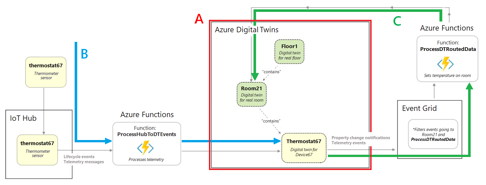

# Build out an end-to-end solution

[source code](https://github.com/azure-samples/digital-twins-samples/tree/main/)  
[Reference](https://learn.microsoft.com/en-us/azure/digital-twins/tutorial-end-to-end)

This Azure Digital Twins tutorial describes how to build out an end-to-end solution that demonstrates the functionality of the service. 
## Prerequisites
- Any code editor
- .NET Core 3.1 on your development machine. [NET Core 3.1](https://dotnet.microsoft.com/download/dotnet-core/3.1)
## Get sample resources
- Download the [resource folder](./resources/).[GitHub repository](https://github.com/azure-samples/digital-twins-samples/tree/main/)
## Prepare an Azure Digital Twins instance
need an Azure Digital Twins instance and the required permissions for using it.
### Prepare your environment for the Azure CLI
- Use the Bash environment in [Azure Cloud Shell](https://learn.microsoft.com/en-us/azure/cloud-shell/overview).
-  run CLI reference commands locally, install the [Azure CLI](https://learn.microsoft.com/en-us/cli/azure/install-azure-cli).
- Run azure cli in a docker container
  ```BASH
  docker run -it mcr.microsoft.com/azure-cli
  ```
  To run a specific version of the Azure CLI in the Docker container, use the following:
  ```BASH
  docker run -it mcr.microsoft.com/azure-cli:<version>
  ```
### Set up CLI session
log in and set the CLI context to your subscription for this session.
```BASH
az login
az account set --subscription "<your-Azure-subscription-ID>"
```
If this is the first time you've used this subscription with Azure Digital Twins, run this command to register with the Azure Digital Twins namespace. 
```BASH
az provider register --namespace 'Microsoft.DigitalTwins'
```
add the Microsoft Azure IoT Extension for Azure CLI, to enable commands for interacting with Azure Digital Twins and other IoT services.
```BASH
az extension add --upgrade --name azure-iot
```
verify by running `az dt --help` at any time to see a list of the top-level Azure Digital Twins commands that are available.
### Configure the sample project
- navigate into digital-twins-samples-main\AdtSampleApp\SampleClientApp and open the appsettings.json file.
  In the file body, change the instanceUrl to your Azure Digital Twins instance host name URL 
  ```JSON
  {
  "instanceUrl": "https://<your-Azure-Digital-Twins-instance-host-name>"
  }
  ```
  Save and close the file.
### Set up local Azure credentials
This sample uses DefaultAzureCredential (part of the Azure.Identity library) to authenticate users with the Azure Digital Twins instance when you run it on your local machine.  
With DefaultAzureCredential, the sample will search for credentials in your local environment, like an Azure sign-in in a local Azure CLI or in Visual Studio or Visual Studio Code. For this reason, you should sign in to Azure locally through one of these mechanisms to set up credentials for the sample.  
If you're using a local CLI window, run the `az login` command to sign in to your Azure account. 
## Get started with the building scenario
*this tutorial represents a real-world building scenario, containing a floor, a room, and a thermostat device. These components will be digitally represented in an Azure Digital Twins instance, which will then be connected to IoT Hub, Event Grid, and two Azure functions to enable movement of data.*

First create the Azure Digital Twins instance (section A in the diagram), then set up the telemetry data flow into the digital twins (arrow B), then set up the data propagation through the twin graph (arrow C).

